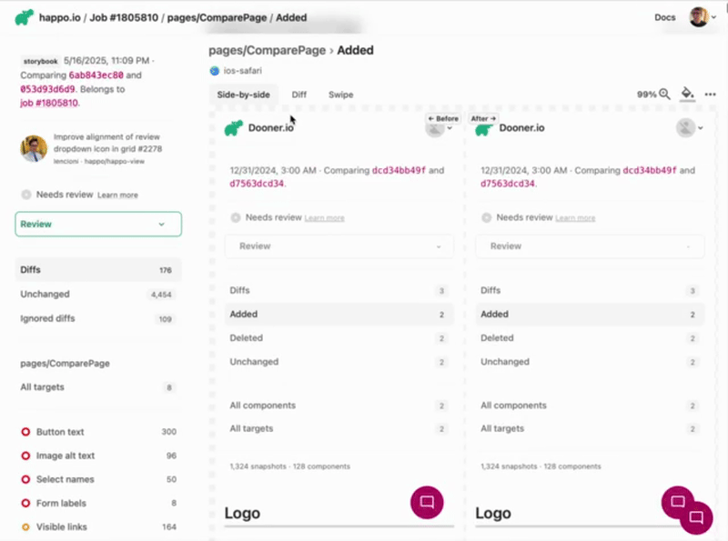

# Gradle Happo Plugin

A Gradle plugin for creating and comparing Happo visual regression test reports from screenshots produced locally. Use it with e.g. [Paparazzi](https://github.com/cashapp/paparazzi),
[Roborazzi](https://github.com/takahirom/roborazzi) or any other tool that can
produce screenshots as PNG files.



## Features

- **Upload Screenshots**: Upload screenshots from a specified folder to Happo and create a Happo report from them.
- **Compare Reports**: Compare two Happo reports by their SHA1 identifiers
- **Configuration**: Support for environment variables and project properties
- **Screenshot Discovery**: Automatically discovers screenshots in the specified directory

## Usage

### Apply the Plugin

```kotlin
plugins {
    id("com.happo.gradle")
}
```

### Configuration

Configure the plugin using the `happo` extension:

```kotlin
happo {
    apiKey = "your-happo-api-key"
    apiSecret = "your-happo-api-secret"
    projectName = "your-happo-project-id"
    screenshotsDir = file("app/build/outputs/roborazzi")
    baseBranch = "origin/main" // Default branch for baseline comparison
}
```

You can also use environment variables or project properties:

```kotlin
happo {
    apiKey = project.findProperty("happo.apiKey")?.toString() ?: System.getenv("HAPPO_API_KEY") ?: ""
    apiSecret = project.findProperty("happo.apiSecret")?.toString() ?: System.getenv("HAPPO_API_SECRET") ?: ""
    projectName = project.findProperty("happo.projectName")?.toString() ?: System.getenv("HAPPO_PROJECT_NAME") ?: ""
    screenshotsDir = file("module/build/outputs/roborazzi")
    baseBranch = project.findProperty("happo.baseBranch")?.toString() ?: System.getenv("HAPPO_BASE_BRANCH") ?: "origin/main"
}
```

**Configuration Properties:**

- `apiKey`: Your Happo API key (required)
- `apiSecret`: Your Happo API secret (required)
- `projectName`: Your Happo project identifier (required)
- `screenshotsDir`: Directory containing screenshot files (defaults to "screenshots")
- `baseUrl`: Happo API base URL (defaults to "https://happo.io")
- `link`: Optional URL link to associate with reports
- `message`: Optional message to include with reports
- `baseBranch`: Base branch to use for baseline comparison in `compareHappoReports` task (defaults to "main")

### Tasks

#### createHappoReport

Uploads all screenshots from the configured directory to Happo and creates a report.

```bash
./gradlew createHappoReport
```

You can also provide optional parameters using Gradle properties:

```bash
./gradlew createHappoReport -Phappo.link="https://github.com/happo/foobar/pr/3" -Phappo.message="PR title"
```

**Parameters:**

- `-Phappo.link`: Optional URL link to associate with the report (e.g., PR link)
- `-Phappo.message`: Optional message to include with the report. If not provided, defaults to the git commit subject

Alternatively, you can configure these in your `build.gradle.kts`:

```kotlin
happo {
    link = "https://github.com/happo/foobar/pr/3"
    message = "PR title"
}
```

This task will:

- Discover all PNG images in the screenshots directory
- Parse component and variant names from filenames
- Upload screenshots to Happo
- Create a Happo report

#### compareHappoReports

Compares two Happo reports by their SHA1 identifiers. By default, it compares
the current HEAD commit with the baseline commit from the main branch. To compare with a different base branch, use the `baseBranch` property.

```bash
./gradlew compareHappoReports
```

You can also provide optional parameters using Gradle properties:

```bash
./gradlew compareHappoReports -Phappo.link="https://github.com/happo/foobar/pr/3" -Phappo.message="PR title" -Phappo.baseBranch="develop"
```

**Parameters:**

- `-Phappo.link`: Optional URL link to associate with the report (e.g., PR link)
- `-Phappo.message`: Optional message to include with the report. If not provided, defaults to the git commit subject
- `-Phappo.baseBranch`: Base branch to use for baseline comparison (defaults to "main")

This task will:

- Find the baseline SHA by figuring out the merge base between the current HEAD with the specified base branch
- Compare the baseline report with the current HEAD report
- Provide a URL to a Happo report showing the results of the comparison

### Screenshot Naming Convention

The plugin supports multiple screenshot naming formats:

#### Standard Format

Screenshots named using the format: `component_variant.png`

Examples:

- `Button_primary.png` → component: "Button", variant: "primary"
- `Card_default.png` → component: "Card", variant: "default"
- `Modal_large.png` → component: "Modal", variant: "large"

#### Roborazzi Format

The plugin supports Roborazzi screenshot naming conventions used by Android UI testing:

- **Roborazzi format**: `package.path.TestClassName.testMethodName.png`

Examples:

- `com.example.helloworldapp.MainActivityTest.testMainActivity.png` → component: "MainActivityTest", variant: "testMainActivity"
- `com.example.app.ui.LoginScreenTest.testLoginWithValidCredentials.png` → component: "LoginScreenTest", variant: "testLoginWithValidCredentials"
- `com.company.feature.PaymentFlowTest.testPaymentSuccess.png` → component: "PaymentFlowTest", variant: "testPaymentSuccess"

The plugin automatically extracts the test class name as the component and the test method name as the variant from Roborazzi-generated screenshots.

### Using the Plugin

```kotlin
plugins {
    id("com.happo.gradle")
}
```

### Using a Local Build

1. Clone this repository
2. Build the plugin: `./gradlew build`
3. Publish to local Maven: `./gradlew publishToMavenLocal`
4. Use in your project:

```kotlin
plugins {
    id("com.happo.gradle")
}

repositories {
    mavenLocal()
}
```

## GitHub Actions Integration

Here's a simplified example of how to use the Happo plugin in a GitHub Actions workflow:

```yaml
name: Visual Regression Tests

on:
  push:
    branches: [main]
  pull_request:
    branches: [main]

jobs:
  happo-tests:
    runs-on: ubuntu-latest
    env:
      HAPPO_API_KEY: ${{ secrets.HAPPO_API_KEY }}
      HAPPO_API_SECRET: ${{ secrets.HAPPO_API_SECRET }}

    steps:
      - name: Checkout code
        uses: actions/checkout@v4
        with:
          fetch-depth: 0 # Required for git operations

      - name: Run tests and generate screenshots
        run: ./gradlew test

      - name: Create Happo report
        run: ./gradlew createHappoReport

      - name: Compare Happo reports
        if: github.event_name == 'pull_request'
        run: ./gradlew compareHappoReports
```

**Key points:**

- Set up your Happo API credentials as GitHub secrets (`HAPPO_API_KEY` and `HAPPO_API_SECRET`)
- Use `fetch-depth: 0` to ensure full git history is available for baseline comparisons
- The workflow creates a report from your screenshots
- For PR builds, we compare the current report with a baseline report

## Development

### Building

```bash
./gradlew build
```

### Testing

```bash
./gradlew test
```

### Publishing

```bash
./gradlew publishToMavenLocal
```

## License

This project is licensed under the MIT License.
